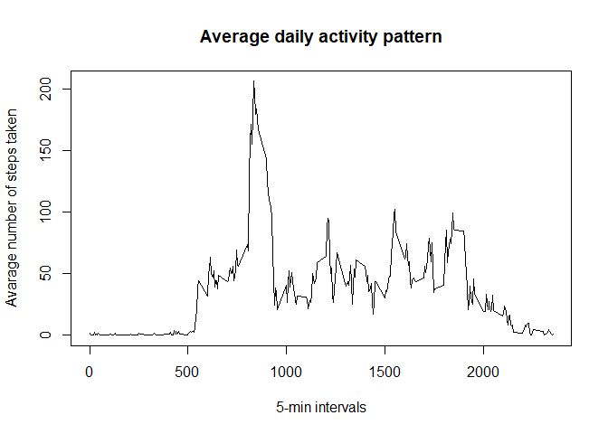

## Loading and preprocessing the data

```r
rawActivity  <- read.csv("activity.csv", header = TRUE)
head(rawActivity )
```

```
##   steps       date interval
## 1    NA 2012-10-01        0
## 2    NA 2012-10-01        5
## 3    NA 2012-10-01       10
## 4    NA 2012-10-01       15
## 5    NA 2012-10-01       20
## 6    NA 2012-10-01       25
```

```r
# Remove NA
activity <-na.omit(rawActivity)
head(activity )
```

```
##     steps       date interval
## 289     0 2012-10-02        0
## 290     0 2012-10-02        5
## 291     0 2012-10-02       10
## 292     0 2012-10-02       15
## 293     0 2012-10-02       20
## 294     0 2012-10-02       25
```


## What is mean total number of steps taken per day?
### 1- Calculate the total number of steps taken per day

```r
totalDailySteps <- with(activity, tapply(steps,date, sum))
```

### 2- Make a histogram of the total number of steps taken each day


```r
hist(totalDailySteps, xlab = "Total daily Steps",main="Histogram of Total Steps per day", col ="blue", breaks = 20)
```

<!-- -->

### 3- Calculate and report the mean and median of the total number of steps taken per day


```r
steps.mean <- mean(totalDailySteps)
print(steps.mean)
```

```
## [1] 10766.19
```

```r
steps.median <- median(totalDailySteps)
print(steps.median)
```

```
## [1] 10765
```


## What is the average daily activity pattern?
### 1- Make a time series plot (i.e. \color{red}{\verb|type = "l"|}type = "l") of the 5-minute interval (x-axis) and the average number of steps taken, averaged across all days (y-axis)

```r
averageDailyinterval <- with(activity, tapply(steps,interval, mean))

plot(names(averageDailyinterval),averageDailyinterval ,  type = "l", 
           main = "Average daily activity pattern", 
           ylab = "Avarage number of steps taken", 
          xlab = "5-min intervals")
```

<!-- -->

### 2- Which 5-minute interval, on average across all the days in the dataset, contains the maximum number of steps?


```r
maxInterval <- which.max(averageDailyinterval)
print(names(maxInterval))
```

```
## [1] "835"
```


## Imputing missing values
### 1- Calculate and report the total number of missing values in the dataset (i.e. the total number of rows with \color{red}{\verb|NA|}NAs)

```r
steps.NA <- is.na(rawActivity$steps)
print(sum(steps.NA))
```

```
## [1] 2304
```

```r
#print( dim(rawActivity)[1]- dim(activity)[1])
#print(length(which(is.na(rawActivity$steps))))
```

### 2- Devise a strategy for filling in all of the missing values in the dataset. The strategy does not need to be sophisticated. For example, you could use the mean/median for that day, or the mean for that 5-minute interval, etc

#### Add a new column to the dataset


```r
rawActivity$steps.updated <- rawActivity$steps
#head(rawActivity)
averageIntervalsteps <- with(activity, tapply(steps,interval, mean))
head(averageIntervalsteps)
```

```
##         0         5        10        15        20        25 
## 1.7169811 0.3396226 0.1320755 0.1509434 0.0754717 2.0943396
```

```r
for (i in 1:nrow(rawActivity)){
        if(is.na(rawActivity$steps[i])){
                rawActivity$steps.updated[i]<- averageIntervalsteps[rawActivity$interval[i] == names((averageIntervalsteps))]
        }
       
}
totalDailySteps2 <- with(rawActivity, tapply(steps.updated,date, sum))
```

### 2- Make a histogram of the total number of steps taken each day


```r
hist(totalDailySteps2, xlab = "Total daily Steps",main="Histogram of Total Steps per day", col ="blue", breaks = 20)
```

<!-- -->

### 3- Calculate and report the mean and median of the total number of steps taken per day


```r
steps.mean <- mean(totalDailySteps2)
print(steps.mean)
```

```
## [1] 10766.19
```

```r
steps.median <- median(totalDailySteps2)
print(steps.median)
```

```
## [1] 10766.19
```


## Are there differences in activity patterns between weekdays and weekends?

### 1- Create a new factor variable in the dataset with two levels – “weekday” and “weekend” indicating whether a given date is a weekday or weekend day.


```r
activity$dayofweek <- weekdays(as.Date(activity$date))
activity$weekend <-as.factor(activity$dayofweek=="Saturday"|activity$dayofweek=="Sunday")
levels(activity$weekend) <- c("Weekday", "Weekend")
```

### 2- Make a panel plot containing a time series plot (i.e. \color{red}{\verb|type = "l"|}type = "l") of the 5-minute interval (x-axis) and the average number of steps taken, averaged across all weekday days or weekend days (y-axis). See the README file in the GitHub repository to see an example of what this plot should look like using simulated data.


```r
sub_weekday = subset(activity, activity$weekend =="Weekday")
head(sub_weekday)
```

```
##     steps       date interval dayofweek weekend
## 289     0 2012-10-02        0   Tuesday Weekday
## 290     0 2012-10-02        5   Tuesday Weekday
## 291     0 2012-10-02       10   Tuesday Weekday
## 292     0 2012-10-02       15   Tuesday Weekday
## 293     0 2012-10-02       20   Tuesday Weekday
## 294     0 2012-10-02       25   Tuesday Weekday
```

```r
sub_weekend = subset(activity, activity$weekend =="Weekend")
head(sub_weekend)
```

```
##      steps       date interval dayofweek weekend
## 1441     0 2012-10-06        0  Saturday Weekend
## 1442     0 2012-10-06        5  Saturday Weekend
## 1443     0 2012-10-06       10  Saturday Weekend
## 1444     0 2012-10-06       15  Saturday Weekend
## 1445     0 2012-10-06       20  Saturday Weekend
## 1446     0 2012-10-06       25  Saturday Weekend
```


```r
library(ggplot2)
averageweekdayinterval <- with(sub_weekday, tapply(steps,interval, mean))

plot(names(averageweekdayinterval),averageweekdayinterval ,  type = "l", 
           main = "Average wekday activity pattern", 
           ylab = "Avarage number of steps taken", 
          xlab = "5-min intervals")


averageweekendinterval <- with(sub_weekend, tapply(steps,interval, mean))

plot(names(averageweekendinterval),averageweekendinterval ,  type = "l", 
           main = "Average wekend activity pattern", 
           ylab = "Avarage number of steps taken", 
          xlab = "5-min intervals")

df0 <- as.data.frame.table(averageweekdayinterval)
df0$weekend <- "weekday"
df1 <- as.data.frame.table(averageweekendinterval)
df1$weekend <- "weekend"

activity2 <- rbind(df1, df0)
names(activity2) = c("interval","steps", "weekend")


library(dplyr)
```

```
## 
## Attaching package: 'dplyr'
```

```
## The following objects are masked from 'package:stats':
## 
##     filter, lag
```

```
## The following objects are masked from 'package:base':
## 
##     intersect, setdiff, setequal, union
```

```r
activity2 <- subset(activity2, select=c(weekend,interval,steps))
activity2 <-activity2[order(activity2$interval),]
head(activity2)
```

```
##     weekend interval     steps
## 1   weekend        0 0.0000000
## 289 weekday        0 2.3333333
## 2   weekend        5 0.0000000
## 290 weekday        5 0.4615385
## 3   weekend       10 0.0000000
## 291 weekday       10 0.1794872
```

```r
ggplot(activity2, aes(x=as.integer(interval), y=as.integer(steps) , color=weekend)) + geom_line()+
facet_grid(weekend ~.) + xlab("Interval") + ylab("Mean of Steps") +
    ggtitle("Comparison of Average Number of Steps in Each Interval")
```


```r
#****************************** 
activity3 <- aggregate(activity$steps , by= list(activity$weekend, activity$interval), na.omit(mean))
names(activity3) <- c("weekend", "interval", "steps")

head(activity3)
```

```
##   weekend interval     steps
## 1 Weekday        0 2.3333333
## 2 Weekend        0 0.0000000
## 3 Weekday        5 0.4615385
## 4 Weekend        5 0.0000000
## 5 Weekday       10 0.1794872
## 6 Weekend       10 0.0000000
```

```r
ggplot(activity3, aes(x=interval, y=steps, color=weekend)) + geom_line()+
facet_grid(weekend ~.) + xlab("Interval") + ylab("Mean of Steps") +
    ggtitle("Comparison of Average Number of Steps in Each Interval")
```

<!-- -->

```r
#*****************************
```

